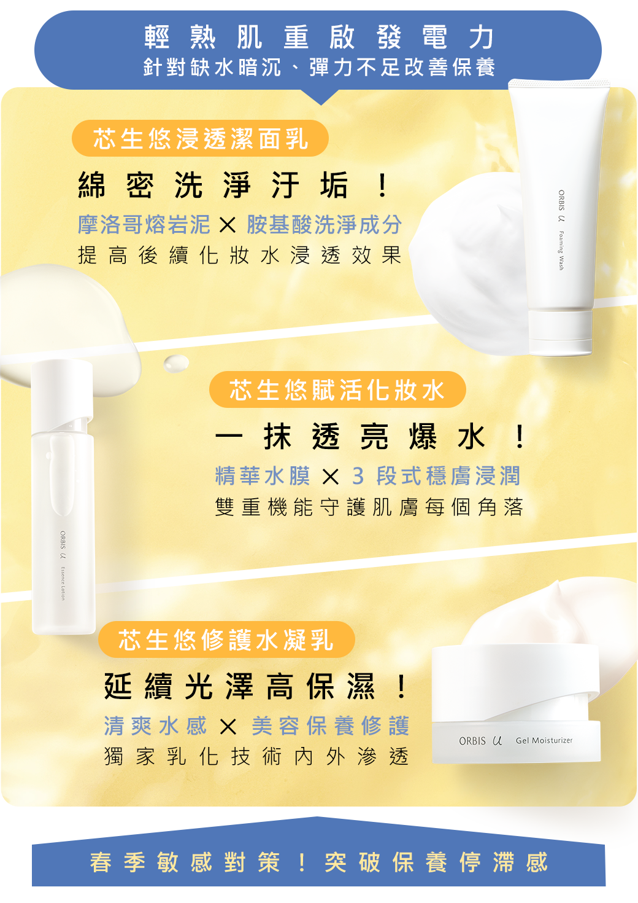
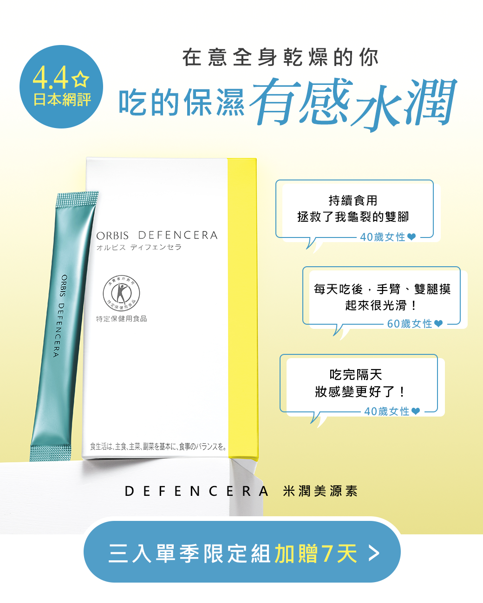
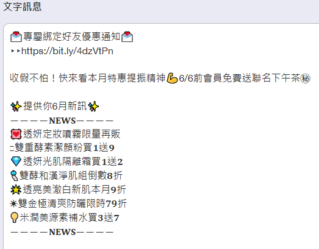
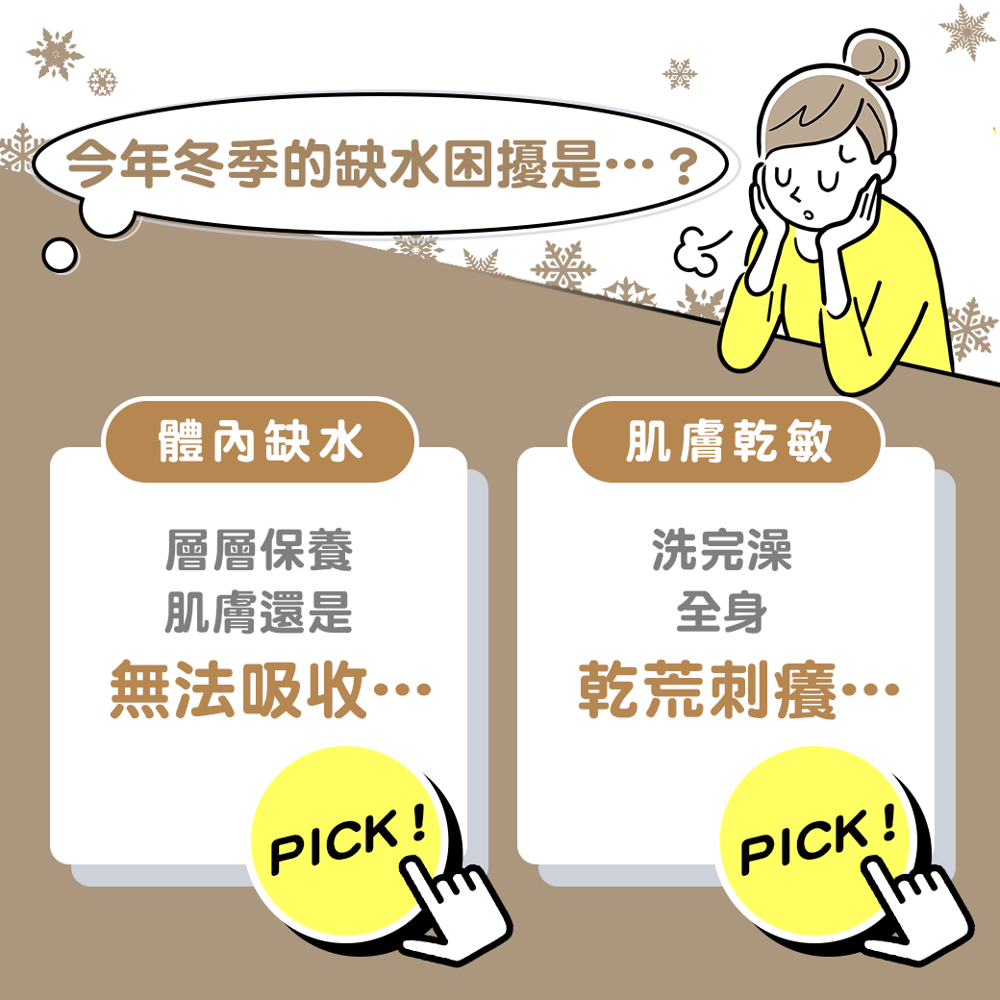
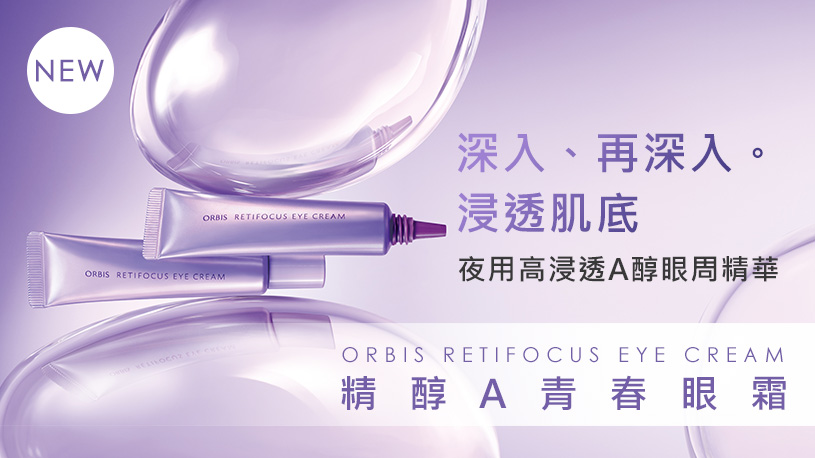

# 製作作品集

## LINE圖文製作

排程策略規劃及文案、排版發想、群發的分眾設定皆由我負責執行，並與設計師協作完成圖文製作。

## 精準行銷

## 趣味性圖文

- 活用精準對象再行銷。
- 針對淺在有興趣者，搭配限時促銷時間點，**達到67.2%開封率。**

---

- 精準設定收信對象。
- 利用貼標籤功能，收集對產品點擊過用戶、興趣標籤對象投放相關產品。
- **達到21.5%開封率及8.2%點擊率。**

- 以知識型結合真實口碑。
- 針對淺在感興趣者投遞訊息，**達到19%開封率、5.2%點擊率。**

- 針對綁定好友優先在月初通知本月優惠訊息。
- 執行會員管理及更新名單。
- 打造個人化特別通知，**達到平均35%的開封率**。

- 以趣味性圖文吸引點擊，增加訊息互動性及引發好奇。
- 針對選擇投遞不同商品及推薦特惠，增加個人化推薦好感。
- **達到11.2%開封率。**

---

## 官網商品頁製作

消化商品資訊►了解主要客群►換句話說解釋產品力►主視覺編排設計

[https://www.orbis.com.tw/u/fck/9069.jpg](https://www.orbis.com.tw/u/fck/9069.jpg)

[https://www.orbis.com.tw/u/fck/8973.jpg](https://www.orbis.com.tw/u/fck/8973.jpg)

[https://www.orbis.com.tw//u/fck/9031_page.jpg](https://www.orbis.com.tw//u/fck/9031_page.jpg)

[https://www.orbis.com.tw/u/fck/20230727_9005.jpg](https://www.orbis.com.tw/u/fck/20230727_9005.jpg)